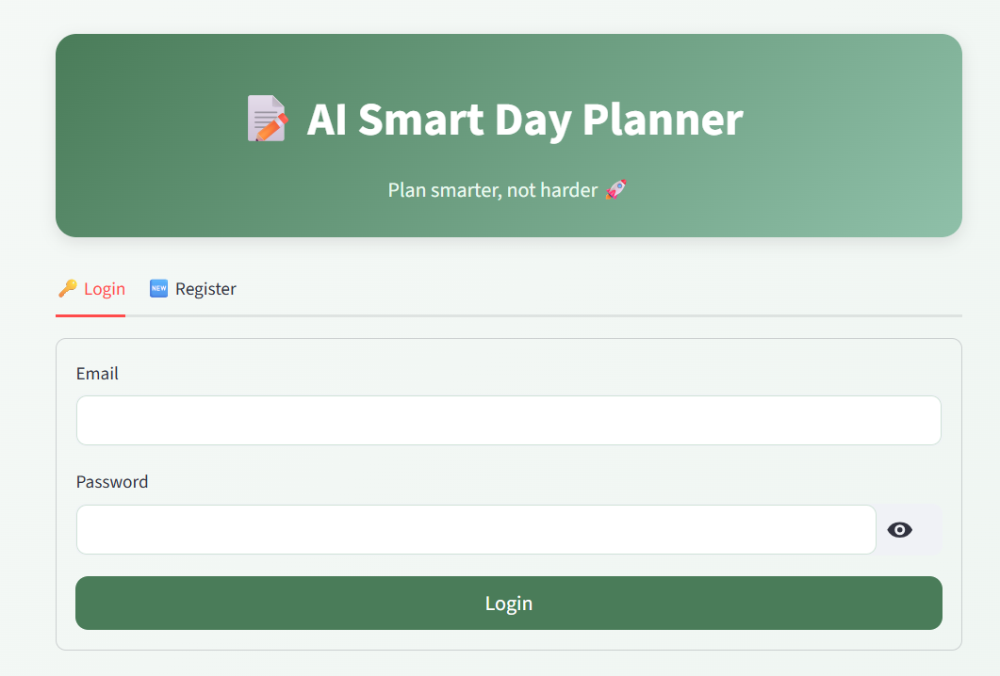
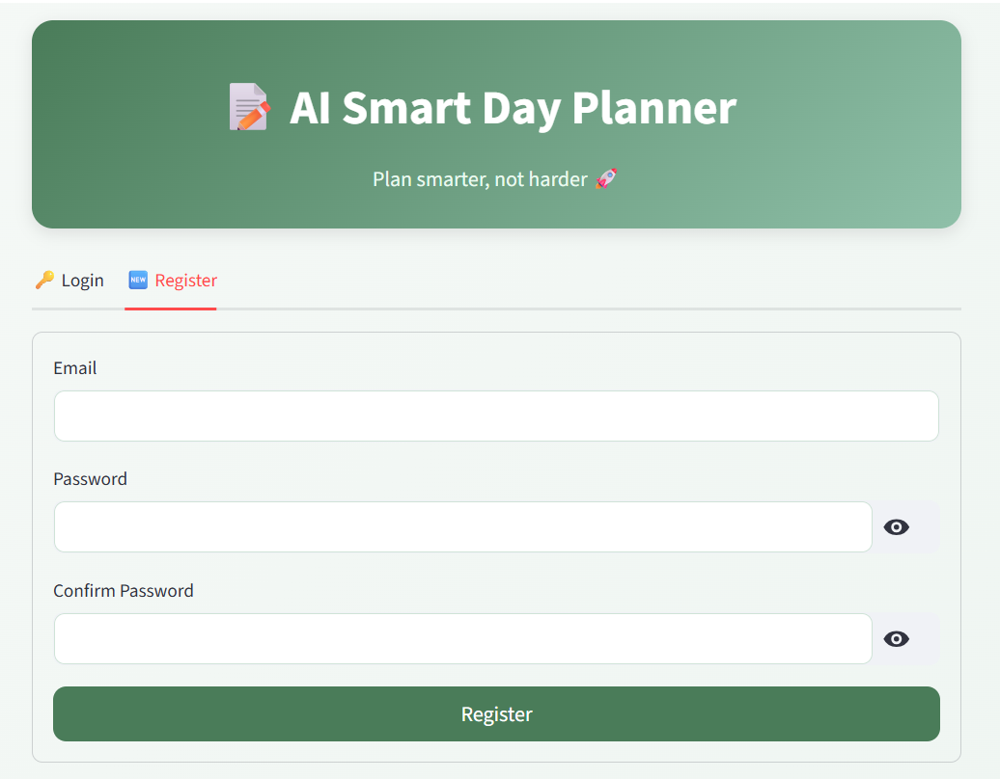
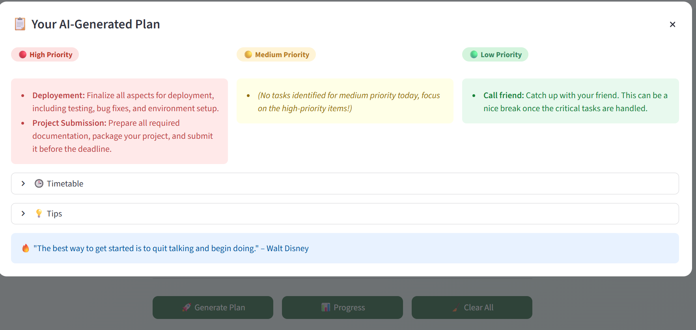
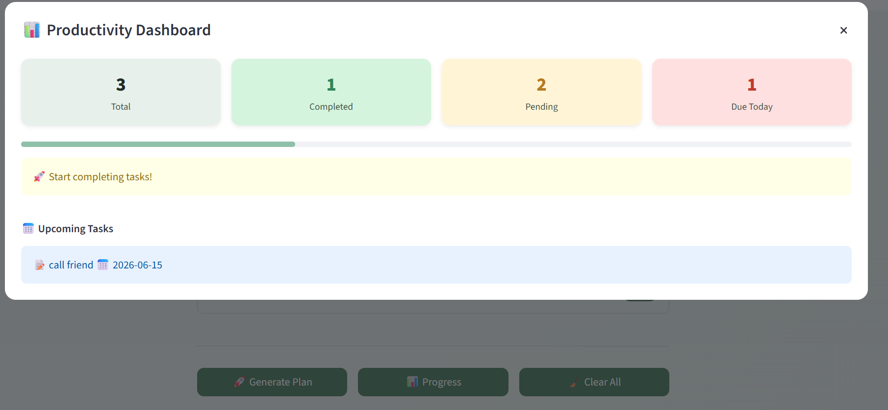
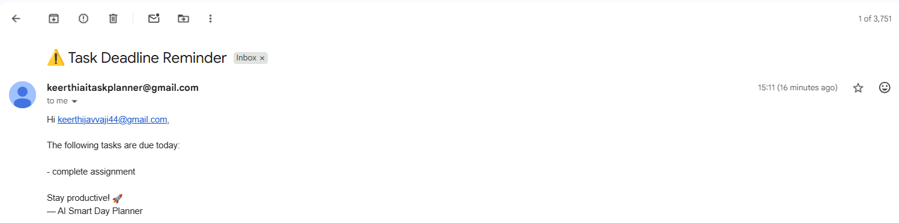

<<<<<<< HEAD
# 📝 AI Smart Day Planner

## 📌 Project Overview

AI Smart Day Planner is a multi-user personal productivity application built using **Python** and **Streamlit**. It helps users organize daily tasks, track progress, and generate an AI-powered work/study plan based on pending tasks and deadlines.

The application supports **secure user authentication**, **SQLite database storage**, and **automatic email reminders** for tasks due on the current day.

---

## 🚀 Features

- ✅ User Registration & Login (bcrypt hashed passwords)
- ✅ Cookie-based session persistence (stay logged in after refresh)
- ✅ Add, delete, and complete tasks
- ✅ Set task deadlines with visual status badges
- ✅ SQLite database for persistent multi-user storage
- ✅ AI-generated daily task plan (High / Medium / Low priority)
- ✅ Suggested timetable, productivity tips & daily motivation
- ✅ Progress tracking dashboard with metrics
- ✅ Upcoming tasks view
- ✅ Automatic email reminders for due tasks (per user)
- ✅ Clean gradient UI with modal dialogs

---

## 🛠️ Technologies Used

| Layer | Technology |
|---|---|
| Frontend | Streamlit |
| AI/LLM | Google Gemini API (gemini-2.5-flash) |
| Database | SQLite (Python sqlite3) |
| Authentication | bcrypt |
| Email | smtplib + Gmail SMTP |
| Automation | Windows Task Scheduler |
| Session | extra-streamlit-components (cookies) |
| Config | python-dotenv |

---

## 📂 Project Structure
AI_TASK_PLANNER/

│

├── app.py              # Main Streamlit application

├── task_manager.py     # Database, authentication & task operations

├── ai_planner.py       # Google Gemini API integration

├── notifier.py         # Automated email reminder script

├── planner.db          # SQLite database (auto-created on first run)

├── .env                # Environment variables (not committed to Git)

├── requirements.txt    # Python dependencies

└── README.md           # Project documentation

---

## ⚙️ Installation

Clone the repository:

```bash
git clone <repository_url>
cd AI_TASK_PLANNER
```

Install dependencies:

```bash
pip install -r requirements.txt
```

---

## 🔑 Environment Variables

Create a `.env` file and add:

```env
GEMINI_API_KEY=your_gemini_api_key
SENDER_EMAIL=your_sender_gmail@gmail.com
SENDER_APP_PASSWORD=your_16_char_app_password
```

> **Note:** `SENDER_APP_PASSWORD` is a Gmail App Password, not your regular Gmail password. Enable 2-Step Verification and generate one at https://myaccount.google.com/apppasswords

---

## ▶️ Run the Application

```bash
streamlit run app.py
```

The database (`planner.db`) is created automatically on first run.

---

## 📧 Email Reminder System

`notifier.py` checks all users' tasks in the database every time it runs.

An email is sent when:
- Deadline = Today's date
- Task is not completed
- Notification has not already been sent (`notified = 0`)

Each user receives reminders only for their own tasks at their registered email address.

**Run manually:**
```bash
python notifier.py
```

**Automate with Windows Task Scheduler:**
- Program: `C:\Path\To\Python\python.exe`
- Arguments: `notifier.py`
- Start in: `C:\Path\To\AI_TASK_PLANNER`
- Trigger: Daily at 8:00 AM, repeat every 1 hour for 1 day

---

## 🤖 AI Planner Workflow

1. User adds tasks with optional deadlines
2. Clicking **Generate Plan** sends pending tasks to Gemini API
3. Gemini categorizes and returns a structured plan
4. Plan is parsed and displayed in a modal with:
   - 🔴 High Priority / 🟡 Medium Priority / 🟢 Low Priority
   - 🕒 Suggested Timetable
   - 💡 Productivity Tips
   - 🔥 Daily Motivation Quote

---

## 📊 Progress Dashboard

Clicking **My Progress** opens a modal showing:
- Total / Completed / Pending / Due Today metrics
- Visual progress bar with productivity score
- Motivational message based on completion %
- Upcoming tasks sorted by deadline

---

## 📷 Screenshots

*(Add screenshots of your application here)*







---

## 🔮 Future Enhancements

- Cloud deployment with SQLite
- Weekly productivity reports
- Desktop push notifications
- Mobile responsive UI
- Task categories and tags

---

## 👩‍💻 Author

**Javvaji Jyothi Keerthana**

AI Smart Day Planner was developed as a personal productivity and AI-based task management project using Python, Streamlit, and Google Gemini API.
=======
# AI_TASK_PLANNER
>>>>>>> 3efc559eb4b9ced41b4ff1bee09b40ca0bc582b5
